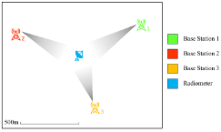

# Assessing Interference with Regression Analysis Techniques


[Jonathan Swindell*](https://github.com/JonathanSwindell/JonathanSwindell), [Carson Slater](https://github.com/carsonslater), Samuel Hussey, Charles Baylis, Robert J. Marks II



### Overview

[Paper](https://doi.org/10.1109/WMCS62019.2024.10619025)

This work proposes using regression analysis to predict aggregate interference in next-generation Dynamic Spectrum Access (DSA) systems, which must operate in real-time. The generalized additive model performs comparably to other machine learning methods but is much faster to train, making it suitable for dynamic spectrum environments. 

***
### Motivation


***
### Methodology

Previously, other methods employed to model aggregate interference in Dynamic Spectrum Access (DSA) systems featured machine learning models, of which are not the most parsimoious. This approach simply considers employing a generalized linear model to predict this interference. Machine learning generally exploits correlations within data to develop accurate predictions, but can be hard to interpret. This is why many ML models are referred to as `black box models.’ Regression models, although rudimentary, could prove useful as they are interpretable and relatively computationally inexpensive.

After exploring some different models, we found one of the simplest, yet most accurate models was the following:
```math
\hat{R}_{PSD} = \hat{\beta}_0 + \hat{\beta}_1 T_{PSD} + \hat{\beta}_2 f(D).
```
Where the $`R_{PSD}`$ and $`T_{PSD}`$ are the recieved and transmitted power spectral density, and $`f(D)`$ is a transformation of the distance from the transmitter to the reciever. Using this simple, trivial yet powerful model, we were able to obtain performance metrics that are comparable to other machine learning models.
***
### Analysis

Below is a table of important files that are required to replicated and tinker with our anaylsis. Most of the analysis was done in R/RStudio, using a select set of packages in the [`tidymodels`](https://www.tidymodels.org) metapackage. Additionally, surface plots were made in MatLab.